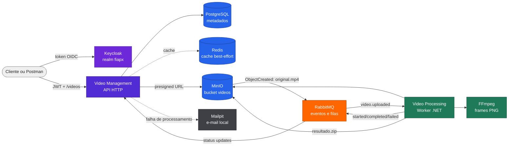

# fiapx-infra

Infraestrutura Docker Compose da solução FiapX, responsável por subir o ambiente integrado com API, Worker, banco de dados, cache, mensageria, armazenamento, identidade e e-mail local.

[]()
[]()
[]()
[](https://github.com/fabianorodrigues/fiapx-infra/actions/workflows/ci.yml)
[](https://github.com/fabianorodrigues/fiapx-infra/actions/workflows/cd.yml)

## Sumário

- [Visão geral](#visão-geral)
- [Solução integrada](#solução-integrada)
- [Responsabilidade deste repositório](#responsabilidade-deste-repositório)
- [Pré-requisitos](#pré-requisitos)
- [Configuração](#configuração)
- [Execução local](#execução-local)
- [CI/CD](#cicd)
- [Health e validação](#health-e-validação)
- [Recuperação e volumes](#recuperação-e-volumes)
- [Próxima etapa](#próxima-etapa)

---

## Visão geral

Este é o repositório inicial para quem quer executar a solução FiapX completa. Ele concentra o Compose integrado e os artefatos versionados necessários para provisionar o ambiente local/demonstrativo.

| Repositório | Papel |
| --- | --- |
| [fiapx-infra](https://github.com/fabianorodrigues/fiapx-infra) | Ambiente integrado, Docker Compose, bootstrap, health, deploy e recuperação |
| [fiapx-video-management](https://github.com/fabianorodrigues/fiapx-video-management) | API HTTP, autenticação, upload, status, listagem, download e notificação de erro |
| [fiapx-video-processing](https://github.com/fabianorodrigues/fiapx-video-processing) | Worker assíncrono, RabbitMQ, MinIO, FFmpeg, ZIP e eventos de processamento |

**Tecnologias:** Docker Compose, PostgreSQL 17, Redis 8, RabbitMQ 4.1, MinIO, Keycloak 26.7, Mailpit, .NET 10, GitHub Actions e PowerShell.

---

## Solução integrada



Fluxo principal:

1. O usuário autentica no Keycloak e chama a API Management.
2. A API registra o vídeo no PostgreSQL e devolve uma URL pré-assinada de upload.
3. O cliente envia `original.mp4` ao MinIO.
4. O MinIO publica o evento no RabbitMQ.
5. O Worker consome a fila, extrai frames com FFmpeg, gera `resultado.zip` e grava no MinIO.
6. O Worker publica eventos de status; a API atualiza o PostgreSQL e invalida o cache Redis.
7. O cliente consulta o status e baixa o ZIP quando o vídeo estiver `CONCLUIDO`.

---

## Responsabilidade deste repositório

| Item | Como é tratado |
| --- | --- |
| Docker Compose integrado | `docker-compose.yml` é o Compose base por imagens; `docker-compose.dev.yml` compila os repositórios irmãos |
| PostgreSQL | Criado pelo container; schema aplicado por `video-management-migrations` |
| Redis | Criado vazio e usado como cache best-effort pela API |
| RabbitMQ | Topologia versionada em `rabbitmq/definitions.json` |
| MinIO | Bucket e notificação AMQP criados por `minio-init` |
| Keycloak | Realm, clients e usuários DEMO versionados em `keycloak/fiapx-realm.json` |
| Mailpit | SMTP e UI local para validar notificações de erro |
| Deploy | Workflows `ci.yml` e `cd.yml`, com scripts em `.github/scripts/` |

O Compose base não compila código. Ele usa as imagens indicadas em `VIDEO_MANAGEMENT_IMAGE` e `VIDEO_PROCESSING_IMAGE`. Para desenvolvimento local com build dos repositórios irmãos, use também `docker-compose.dev.yml`.

---

## Pré-requisitos

Para execução local integrada:

| Requisito | Observação |
| --- | --- |
| Docker + Docker Compose | Necessário para todos os serviços |
| PowerShell | Necessário para o script E2E |
| Repositórios irmãos no mesmo diretório pai | Necessário somente no modo dev com `docker-compose.dev.yml` |

Estrutura esperada para build local:

```text
fiap-fase5/
  fiapx-infra/
  fiapx-video-management/
  fiapx-video-processing/
```

Para deploy via GitHub Actions, o runner self-hosted Windows também precisa ter Docker, Docker Compose, PowerShell e acesso ao GHCR das imagens publicadas pelos repositórios dos serviços.

---

## Configuração

### Arquivos de ambiente

| Item | Classificação | Uso |
| --- | --- | --- |
| `.env.example` | JÁ VERSIONADO | Modelo DEMO/local. Não deve receber secrets reais |
| `.env` | LOCAL/NÃO VERSIONADO | Fonte operacional para execução local e CD |
| `VIDEO_MANAGEMENT_IMAGE` | MANUAL OBRIGATÓRIO no modo image-only | Imagem da API usada pelo Compose base |
| `VIDEO_PROCESSING_IMAGE` | MANUAL OBRIGATÓRIO no modo image-only | Imagem do Worker usada pelo Compose base |
| `BOOTSTRAP_VIDEO_MANAGEMENT_IMAGE` | MANUAL OBRIGATÓRIO no CD se `.env` ainda não existir | Primeira imagem da API para criar `.env` |
| `BOOTSTRAP_VIDEO_PROCESSING_IMAGE` | MANUAL OBRIGATÓRIO no CD se `.env` ainda não existir | Primeira imagem do Worker para criar `.env` |

Para uso local, crie um `.env` a partir do exemplo:

```powershell
Copy-Item .env.example .env
```

O `.env` é ignorado pelo Git. Use placeholders como `<SEU_VALOR>` para qualquer valor privado e nunca versionar tokens, PATs, JWTs, connection strings privadas, SMTP real ou credenciais de ambiente real.

### Usuários DEMO

O realm Keycloak versionado cria dois usuários para demonstração local:

| Usuário | E-mail |
| --- | --- |
| `usertest1` | `usertest1@fiapx.local` |
| `usertest2` | `usertest2@fiapx.local` |

As senhas desses usuários estão versionadas propositalmente nas fixtures DEMO/local para facilitar a demonstração. Elas são exclusivamente locais, não são seguras para ambiente real e não devem ser reutilizadas fora deste contexto.

### Provisionamento automático e manual

| Item | Classificação | Detalhe |
| --- | --- | --- |
| PostgreSQL container | AUTOMÁTICO | Criado pelo Compose |
| Migrations da API | AUTOMÁTICO | Executadas pelo serviço `video-management-migrations` |
| Redis container | AUTOMÁTICO | Criado pelo Compose |
| RabbitMQ container | AUTOMÁTICO | Criado pelo Compose |
| Exchanges, filas e bindings RabbitMQ | JÁ VERSIONADO / AUTOMÁTICO | Importados de `rabbitmq/definitions.json` |
| MinIO container | AUTOMÁTICO | Criado pelo Compose |
| Bucket `videos` | AUTOMÁTICO | Criado por `minio-init` |
| Evento MinIO para `videos/*/original.mp4` | AUTOMÁTICO | Criado por `minio-init` no ambiente integrado |
| Keycloak realm `fiapx` | JÁ VERSIONADO / AUTOMÁTICO | Importado de `keycloak/fiapx-realm.json` |
| Usuários DEMO | JÁ VERSIONADO / AUTOMÁTICO | Criados pelo import do realm |
| Mailpit | AUTOMÁTICO | Criado pelo Compose |
| Imagens GHCR dos serviços | MANUAL OBRIGATÓRIO para image-only/CD | Produzidas pelos repositórios Management e Processing |
| Runner self-hosted | MANUAL OBRIGATÓRIO para CD | Não é necessário para execução local |

### GitHub Variables

Configure em `Settings > Secrets and variables > Actions > Variables`.

| Variável | Repositório | Obrigatória | Quando |
| --- | --- | --- | --- |
| `DEPLOY_INFRA_PATH` | Infra, Management e Processing | Sim para CD | Caminho da working copy operacional da infra |
| `BOOTSTRAP_VIDEO_MANAGEMENT_IMAGE` | Infra | Condicional | Apenas se o CD da infra precisar criar `.env` |
| `BOOTSTRAP_VIDEO_PROCESSING_IMAGE` | Infra | Condicional | Apenas se o CD da infra precisar criar `.env` |

Valor típico de `DEPLOY_INFRA_PATH` no runner Windows:

```text
C:\Projetos\fiap-fase5\fiapx-infra
```

As imagens de bootstrap devem estar pinadas por tag SHA de commit ou digest:

```text
ghcr.io/<owner>/fiapx-video-management:<commit-sha>
ghcr.io/<owner>/fiapx-video-processing:<commit-sha>
```

---

## Execução local

### Modo recomendado: ambiente integrado com build local

Use este modo quando estiver com os três repositórios clonados no mesmo diretório pai.

```powershell
docker compose `
  --env-file .env `
  -f docker-compose.yml `
  -f docker-compose.dev.yml `
  up -d --build
```

Para escalar o Worker:

```powershell
docker compose `
  --env-file .env `
  -f docker-compose.yml `
  -f docker-compose.dev.yml `
  up -d --build --scale video-processing-service=3
```

### Modo por imagens

Use este modo quando `VIDEO_MANAGEMENT_IMAGE` e `VIDEO_PROCESSING_IMAGE` já apontarem para imagens existentes.

```powershell
docker compose `
  --env-file .env `
  -f docker-compose.yml `
  up -d
```

Para escalar o Worker por imagens:

```powershell
docker compose `
  --env-file .env `
  -f docker-compose.yml `
  up -d --scale video-processing-service=3
```

### URLs locais

| Serviço | URL |
| --- | --- |
| Video Management API | `http://localhost:8080` |
| Keycloak | `http://localhost:8081` |
| MinIO API | `http://localhost:9000` |
| MinIO Console | `http://localhost:9001` |
| RabbitMQ Management | `http://localhost:15672` |
| Mailpit | `http://localhost:8025` |
| PostgreSQL | `localhost:5432` |
| Redis | `localhost:6379` |

---

## CI/CD

### CI

O workflow `.github/workflows/ci.yml` roda em `ubuntu-24.04` para:

- `pull_request`;
- `push` na branch `main`;
- `workflow_dispatch`.

Valida:

| Validação | Origem |
| --- | --- |
| Docker Compose | `docker compose config` |
| JSON RabbitMQ e Keycloak | `rabbitmq/definitions.json`, `keycloak/fiapx-realm.json` |
| PowerShell | Parser dos scripts |
| Segurança de `.env` | `.env` não pode estar versionado |
| `.env.example` | Deve permanecer DEMO/local |
| Imagens | Compose base não pode usar `build` nem imagem `latest` |
| Topologia | Serviços, volumes, filas, exchanges, policies e usuários esperados |

### CD

O CD roda por `workflow_run` depois do CI verde em `main`. O workflow usa `head_sha`, valida se esse SHA ainda é o HEAD atual da `main` e falha fechado quando não consegue comprovar isso.

Runner esperado:

| Item | Valor |
| --- | --- |
| Sistema | Windows self-hosted |
| Labels | `self-hosted`, `Windows`, `X64`, `fiap-fase5` |
| Pasta sugerida | `C:\actions-runner-infra` |
| Inicialização | `run.cmd`, não Windows Service |

O deploy participa do mutex global:

```text
Global\FiapXDeployLock
```

Ordem operacional do CD:

1. Adquire o lock.
2. Captura a escala existente do Processor.
3. Atualiza a working copy operacional para o `GITHUB_SHA` implantado.
4. Valida `.env` e Compose.
5. Faz pull das imagens.
6. Sobe PostgreSQL, Redis, RabbitMQ, MinIO, Keycloak e Mailpit.
7. Reconcilia RabbitMQ.
8. Executa `minio-init`.
9. Executa migrations da API.
10. Recria o Management.
11. Recria o Processing preservando escala explícita.
12. Valida health integrado.

O CD não executa `docker compose up -d` genérico e não remove volumes automaticamente.

---

## Health e validação

### Health rápido

```powershell
Invoke-RestMethod http://localhost:8080/health
Invoke-RestMethod http://localhost:8081/realms/fiapx
Invoke-RestMethod http://localhost:9000/minio/health/ready
Invoke-WebRequest http://localhost:8025 -UseBasicParsing
```

Verifique os containers:

```powershell
docker compose --env-file .env -f docker-compose.yml ps
```

Verifique consumidores do Worker:

```powershell
docker compose --env-file .env -f docker-compose.yml exec rabbitmq `
  rabbitmqctl list_queues name consumers
```

A fila `video.processing` deve ter `consumer_count` maior ou igual à escala do `video-processing-service`.

### E2E integrado

O script E2E cria vídeos sintéticos, autentica, envia upload, valida status, baixa ZIP, exercita retry/DLQ e registra evidências em `artifacts/e2e-rabbitmq-results.json`.

Modo dev:

```powershell
.\scripts\e2e-rabbitmq.ps1 -EnvFile .\.env.example -BootstrapUsers
```

Modo por imagens, com `.env` apontando para imagens já existentes:

```powershell
.\scripts\e2e-rabbitmq.ps1 -EnvFile .\.env -ImageOnly -SkipBuild -BootstrapUsers
```

---

## Recuperação e volumes

Volumes versionados no Compose:

| Volume | Conteúdo |
| --- | --- |
| `postgres-data` | Dados e schema do PostgreSQL |
| `redis-data` | Persistência AOF do Redis |
| `minio-data` | Objetos do bucket |
| `minio-events` | Fila local de eventos AMQP do MinIO |
| `rabbitmq-data` | Estado do RabbitMQ |

Cenário suportado pelo CD:

```text
containers ausentes
images ausentes
volumes preservados
        |
CD/bootstrap da infra
        |
pull das imagens
        |
recriação da stack
        |
health integrado
```

O deploy não executa:

- `docker compose down -v`;
- `docker volume prune`;
- `docker system prune`.

Rollback de commit de infraestrutura reconcilia configuração versionada, mas não desfaz dados, objetos, filas, estado do Keycloak ou migrations já aplicadas.

---

## Próxima etapa

Com o ambiente saudável, siga para a validação da API no [fiapx-video-management](https://github.com/fabianorodrigues/fiapx-video-management).
